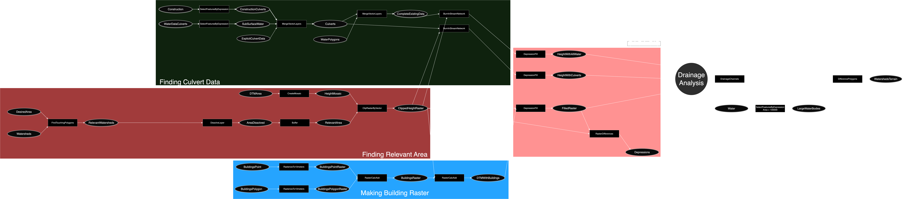

# Drainage Channel Analysis Workflow Optimization

This project evaluates and optimizes common drainage channel analysis workflows for Norwegian terrain using free and open-source Geographic Information Systems (GIS). Specifically, it uses QGIS, WhiteboxTools and SAGA GIS within a Docker environment to assess and improve the accuracy and efficiency of current methodologies.

## Project Overview

This thesis methodically evaluates each step in common drainage channel analysis workflows, assesses the impact of various algorithms and settings, and provides recommendations for an optimized approach. All procedures are performed on an area in central Norway and utilize free and open-source software for easy replication.

### Specific Tasks

- **Assess Improvements:** Evaluate potential improvements over current drainage analysis workflows.
- **Methodology Adaptation:** Adapt the current methodology to utilize free and open-source GIS alternatives.
- **Algorithm Analysis:** Analyze networks created by various relevant algorithms and settings.
- **Qualitative Analysis:** Conduct a qualitative analysis of the obtained drainage channels.
- **Optimized Workflow Recommendation:** Recommend an optimal workflow tailored to Norwegian terrain and conditions.

## Prerequisites

Before starting, ensure you have Docker and Docker Compose installed on your system. This project uses the `qgis/qgis` Docker image.

## Installation and Setup

### Run Docker Container:
Run the following command to start an Ubuntu-based Docker container with QGIS Python, WhiteboxTools and SAGA GIS installed.
```bash
docker-compose up -d
```

### Access the QGIS Docker Container:
```bash
docker exec -it drainage_lines bash
```

You can now have access to the shell to run relevant commands.

## Using SAGA GIS Commands

Inside the Docker container, use SAGA GIS commands as needed. For example:

```bash
saga_cmd ta_preprocessor 0 -ELEVATION [/path/to/dem] -FILLED [/path/to/output]
```

## Analysis and Recommendations

The workflow is approximately this:



Follow the steps in the scripts provided in the /scripts directory to perform the analysis. Ensure to document each step and its output for qualitative analysis.

